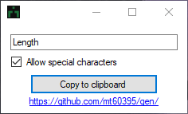

# Gen
## Description
String generator
## Usage
```gen.py``` requires Python. ```gen.js``` may be ran with a web browser or nodejs. ```gen.cpp``` must be compiled before running.
## Notice
```gen.cpp``` depends on the current unix timestamp. Passwords generated within short intervals of each other will be similar. ```gen.cpp``` does not have an option to exclude special characters.
## Preview
Download the latest release from https://github.com/mt60395/gen/releases

